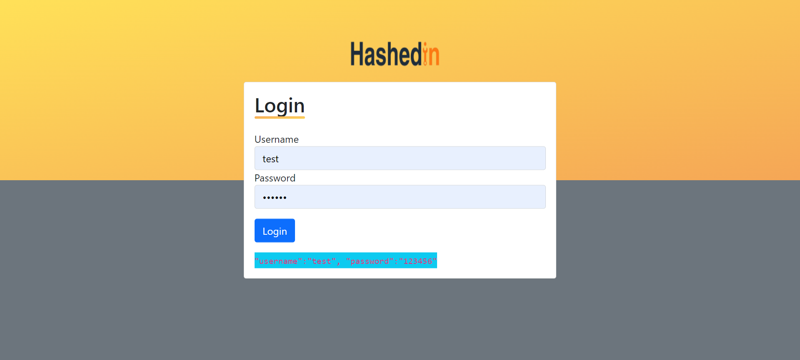
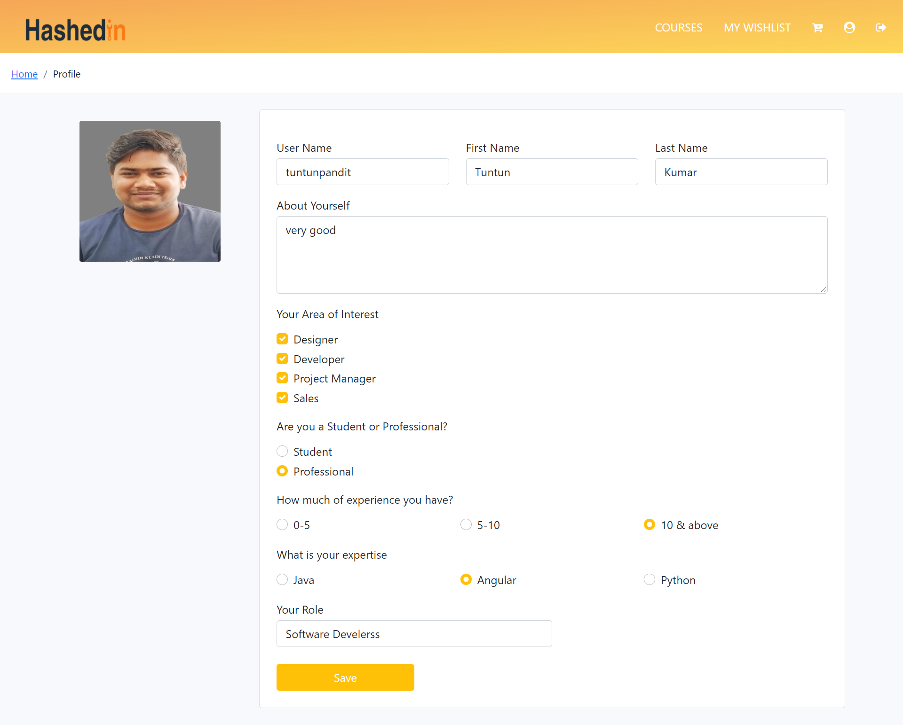
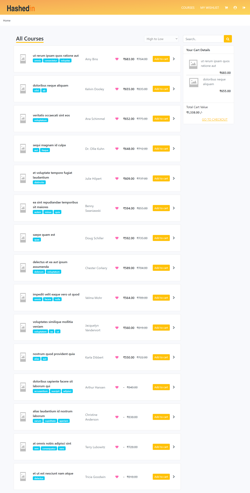
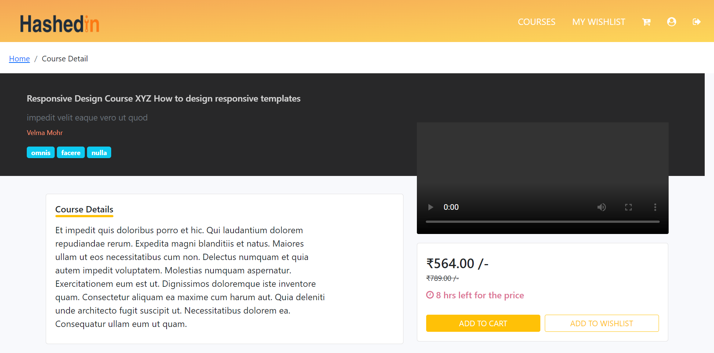
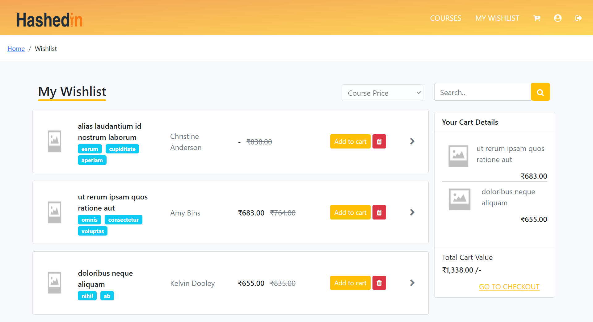
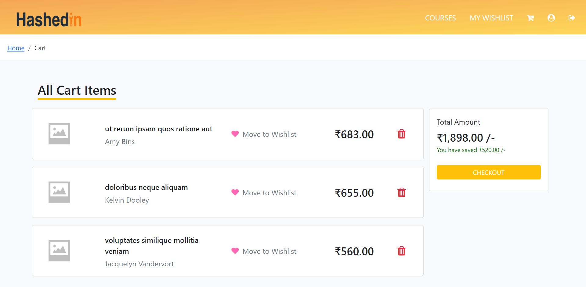

## Milestones 

#### Milestone 1 

Project Setup, completion of Dashboard screen and Top navigation(header) is a must along with proper test cases, and proper handling of the error states. 

#### Milestone 2 

Completion of Checkout screen is a must along with proper test cases, and proper handling of the error states. 
The user should be able to add items from the dashboard screen to cart(milestone 1) and should be able to view the courses on the checkout screen. 

#### Milestone 3 

Completion of Wish List screen is a must along with proper test cases, and proper handling of the error states. 
Move to wishlist feature should be enabled on the dashboard, checkout screen and course details screen. 

#### Milestone 4 

Completion of Course details screen is a must along with proper test cases, and proper handling of the error states. 

#### Milestone 5 

Completion of Profile screen is a must along with proper test cases, and proper handling of the error states. 
Proper validations should be added for different fields. The user should be allowed to save changes even if changes are made to a single form field. 

# Follow these steps to run this project in localhost

Open your terminal and type these:
1. `git clone https://github.com/tuntunHashedin/Angular-Assignment.git`
2. `npm install`
3. `ng serve -o`

# Screeshots

1. **Login Page**
    

      
    

2. **User Profile Page**
    

      
    

3. **All Courses Page**
    

      
    

4. **Course Detail Page**
    

      
    

5. **Wishlist Page**
    

      
    

6. **Cart Page**
    

      
    

